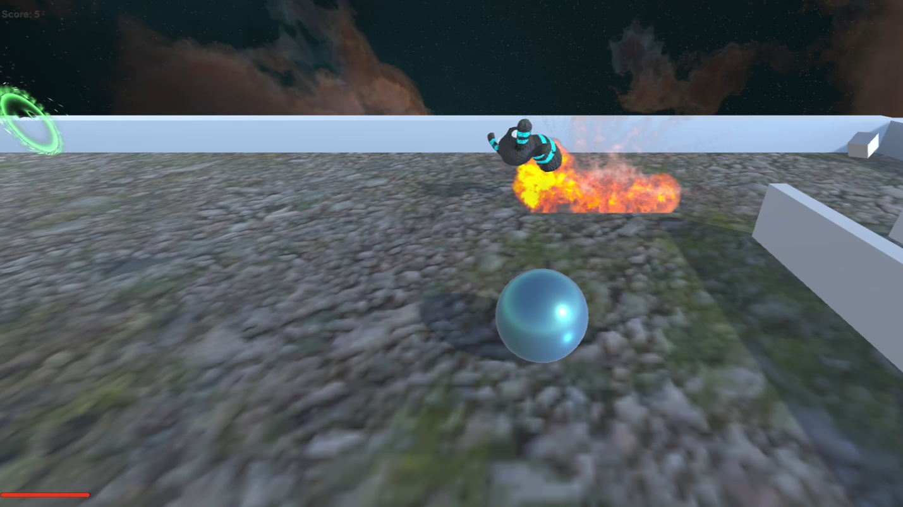
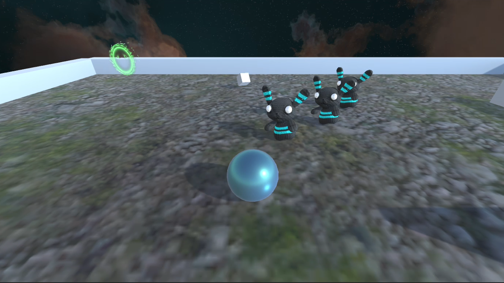
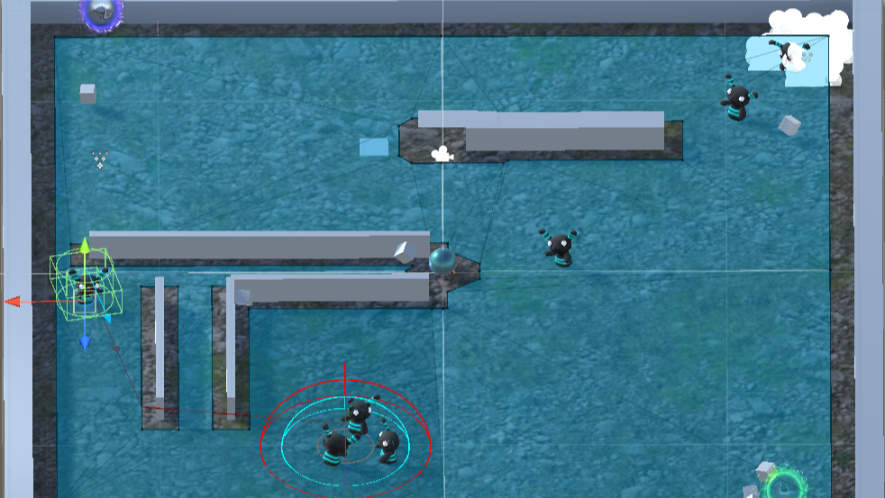

# MiniGame – Unity 3D Project

## Overview

This project is a small 3D game developed in Unity, where the player navigates a closed environment, collects items, avoids or confronts enemies, and uses interactive elements such as teleporters.

The main goal of the game is to collect all the required items while surviving enemy encounters. The game combines player movement, AI-controlled enemies, basic combat mechanics, and environmental interaction.

---

## Core Features

### 🎮 Player Mechanics
- Third-person player movement  
- Ability to shoot projectiles  
- Health system with visual feedback  
- Score system based on collected items  

---

### 👾 Enemy AI
- Enemies patrol the environment using predefined **WaitPoints**  
- When the player is detected, all active enemies switch to **chase mode**  
- Enemies deal damage on contact with the player  
- New enemies spawn periodically during gameplay  

---

### 🧠 Patrol System
- Patrol routes are defined using **empty GameObjects (WaitPoints)**  
- Enemies move between these points with a waiting time at each location  
- A dynamic radius system prevents enemies from getting stuck when multiple agents reach the same point  

---

### 💥 Combat System
- The player can shoot projectiles
- Projectiles move forward and:
  - Destroy themselves after a certain time
  - Trigger an explosion on impact
- Enemies die when hit by a projectile

---

### 🌀 Teleportation System
- Teleporters allow the player to move between predefined locations
- Only the player can activate teleporters
- Teleporters include visual effects for better feedback

---

### ✨ Visual Effects
- Explosion effects when projectiles collide
- Spawn effects when new enemies appear
- Teleportation effects for portals

---

## Technical Highlights

- Use of **NavMeshAgent** for enemy navigation
- Use of **InvokeRepeating** for timed enemy spawning
- Modular system using **LevelPoints** for managing:
  - WaitPoints (patrol)
  - SpawnPoints (enemy generation)
- Event-driven communication between player and enemies

---

## Controls

| Action        | Input            |
|--------------|-----------------|
| Move         | WASD / Arrow keys |
| Shoot        | Assigned input (e.g. mouse click / key) |

---

## Assets Used

The following external assets were used in this project:

- **Zombunny**  
  3D model used for the enemy character  
  https://sketchfab.com/3d-models/zombunny-b9ee1de2bfb34a378410179ba0c38dbe  

- **HQ Explosions Pack FREE (Unity Asset Store)**  
  Used for projectile explosion effects  
  https://assetstore.unity.com/packages/vfx/particles/fire-explosions/hq-explosions-pack-free-263326  

- **Nebula Skyboxes (Unity Asset Store)**  
  Used as the skybox for the environment  
  https://assetstore.unity.com/packages/2d/textures-materials/sky/nebula-skyboxes-219924  

- **msvFX Free Smoke Effects (Unity Asset Store)**  
  Used for enemy spawn visual effects  
  https://assetstore.unity.com/packages/vfx/particles/fire-explosions/free-stylized-smoke-effects-pack-226406  

- **Magic Effects FREE (Unity Asset Store)**  
  Used for teleportation portal effects  
  https://assetstore.unity.com/packages/vfx/particles/spells/magic-effects-free-247933  

All assets used are free and properly attributed.

---

## Requirements

- Unity 2022.2.62f1

## How to Run

1. Open the project in Unity Hub
2. Make sure to use Unity version 2022.2.62f1
3. Load the main scene (`miniGame`)
4. Press **Play**

---

## Notes

- The project is structured to separate gameplay logic, environment, and UI
- The system is designed to be easily extendable (more enemies, more levels, etc.)
- Care has been taken to avoid common AI navigation issues such as agent stacking or blocking

---

